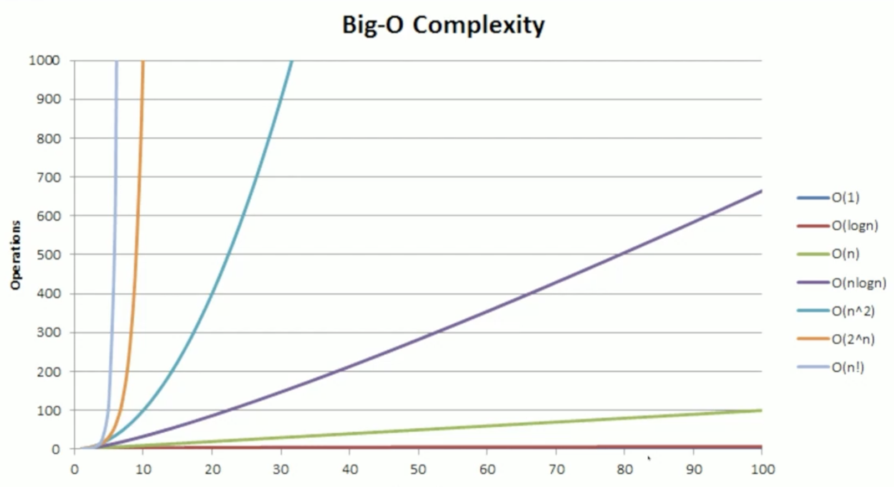

# What is Big O(Oh)? 
- Big O is a way to categorize the algorithms ***time or memory*** requirements.
- It doesn't mean to be an exact measurement.
- It will not tell you how many exact CPU cycles it takes, instead it is meant to generalize growth of the algorithm.

Ex: if someone says Oh of N ```O(N)```, they mean the algorithm will grow linearly based on input.

# Why do we use it?
- It helps us make decisions about what data structure and algorithm to use, knowing how they will perform can greatly help create the best program.

EX:
```
    function sumOfCharCodes(n: string): number {
        let sum: number = 0;
        for (let i = 0; i < s.length; i++) {
            sum += n.charCodeAt(i);
        }
        return sum;
    }
```

# In different words
- As the input grows, how fast does computation or memory grow?

# Key factors
- growth is with respect to the input.

# Important concepts
- Growth is with respect to the input.
- Constants are dropped.
- Worst case is usually the way to measure.

# Common Complexities
